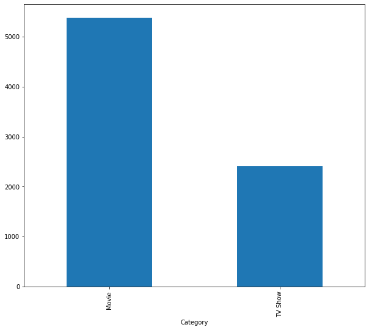

## GETTING KNOW ABOUT DATASET


```python
import pandas as pd
import seaborn as sns
import matplotlib.pyplot as plt
%matplotlib inline
```


```python
 df = pd.read_csv(r'E:\My Works\My Career\Projects\Data Analysis\Netflix Data Analysis\8. Netflix Dataset.csv')
```


```python
df
```


<div>
<style scoped>
    .dataframe tbody tr th:only-of-type {
        vertical-align: middle;
    }

    .dataframe tbody tr th {
        vertical-align: top;
    }

    .dataframe thead th {
        text-align: right;
    }
</style>
<table border="1" class="dataframe">
  <thead>
    <tr style="text-align: right;">
      <th></th>
      <th>Show_Id</th>
      <th>Category</th>
      <th>Title</th>
      <th>Director</th>
      <th>Cast</th>
      <th>Country</th>
      <th>Release_Date</th>
      <th>Rating</th>
      <th>Duration</th>
      <th>Type</th>
      <th>Description</th>
    </tr>
  </thead>
  <tbody>
    <tr>
      <th>0</th>
      <td>s1</td>
      <td>TV Show</td>
      <td>3%</td>
      <td>NaN</td>
      <td>João Miguel, Bianca Comparato, Michel Gomes, R...</td>
      <td>Brazil</td>
      <td>August 14, 2020</td>
      <td>TV-MA</td>
      <td>4 Seasons</td>
      <td>International TV Shows, TV Dramas, TV Sci-Fi &amp;...</td>
      <td>In a future where the elite inhabit an island ...</td>
    </tr>
    <tr>
      <th>1</th>
      <td>s2</td>
      <td>Movie</td>
      <td>07:19</td>
      <td>Jorge Michel Grau</td>
      <td>Demián Bichir, Héctor Bonilla, Oscar Serrano, ...</td>
      <td>Mexico</td>
      <td>December 23, 2016</td>
      <td>TV-MA</td>
      <td>93 min</td>
      <td>Dramas, International Movies</td>
      <td>After a devastating earthquake hits Mexico Cit...</td>
    </tr>
    <tr>
      <th>2</th>
      <td>s3</td>
      <td>Movie</td>
      <td>23:59</td>
      <td>Gilbert Chan</td>
      <td>Tedd Chan, Stella Chung, Henley Hii, Lawrence ...</td>
      <td>Singapore</td>
      <td>December 20, 2018</td>
      <td>R</td>
      <td>78 min</td>
      <td>Horror Movies, International Movies</td>
      <td>When an army recruit is found dead, his fellow...</td>
    </tr>
    <tr>
      <th>3</th>
      <td>s4</td>
      <td>Movie</td>
      <td>9</td>
      <td>Shane Acker</td>
      <td>Elijah Wood, John C. Reilly, Jennifer Connelly...</td>
      <td>United States</td>
      <td>November 16, 2017</td>
      <td>PG-13</td>
      <td>80 min</td>
      <td>Action &amp; Adventure, Independent Movies, Sci-Fi...</td>
      <td>In a postapocalyptic world, rag-doll robots hi...</td>
    </tr>
    <tr>
      <th>4</th>
      <td>s5</td>
      <td>Movie</td>
      <td>21</td>
      <td>Robert Luketic</td>
      <td>Jim Sturgess, Kevin Spacey, Kate Bosworth, Aar...</td>
      <td>United States</td>
      <td>January 1, 2020</td>
      <td>PG-13</td>
      <td>123 min</td>
      <td>Dramas</td>
      <td>A brilliant group of students become card-coun...</td>
    </tr>
    <tr>
      <th>...</th>
      <td>...</td>
      <td>...</td>
      <td>...</td>
      <td>...</td>
      <td>...</td>
      <td>...</td>
      <td>...</td>
      <td>...</td>
      <td>...</td>
      <td>...</td>
      <td>...</td>
    </tr>
    <tr>
      <th>7784</th>
      <td>s7783</td>
      <td>Movie</td>
      <td>Zozo</td>
      <td>Josef Fares</td>
      <td>Imad Creidi, Antoinette Turk, Elias Gergi, Car...</td>
      <td>Sweden, Czech Republic, United Kingdom, Denmar...</td>
      <td>October 19, 2020</td>
      <td>TV-MA</td>
      <td>99 min</td>
      <td>Dramas, International Movies</td>
      <td>When Lebanon's Civil War deprives Zozo of his ...</td>
    </tr>
    <tr>
      <th>7785</th>
      <td>s7784</td>
      <td>Movie</td>
      <td>Zubaan</td>
      <td>Mozez Singh</td>
      <td>Vicky Kaushal, Sarah-Jane Dias, Raaghav Chanan...</td>
      <td>India</td>
      <td>March 2, 2019</td>
      <td>TV-14</td>
      <td>111 min</td>
      <td>Dramas, International Movies, Music &amp; Musicals</td>
      <td>A scrappy but poor boy worms his way into a ty...</td>
    </tr>
    <tr>
      <th>7786</th>
      <td>s7785</td>
      <td>Movie</td>
      <td>Zulu Man in Japan</td>
      <td>NaN</td>
      <td>Nasty C</td>
      <td>NaN</td>
      <td>September 25, 2020</td>
      <td>TV-MA</td>
      <td>44 min</td>
      <td>Documentaries, International Movies, Music &amp; M...</td>
      <td>In this documentary, South African rapper Nast...</td>
    </tr>
    <tr>
      <th>7787</th>
      <td>s7786</td>
      <td>TV Show</td>
      <td>Zumbo's Just Desserts</td>
      <td>NaN</td>
      <td>Adriano Zumbo, Rachel Khoo</td>
      <td>Australia</td>
      <td>October 31, 2020</td>
      <td>TV-PG</td>
      <td>1 Season</td>
      <td>International TV Shows, Reality TV</td>
      <td>Dessert wizard Adriano Zumbo looks for the nex...</td>
    </tr>
    <tr>
      <th>7788</th>
      <td>s7787</td>
      <td>Movie</td>
      <td>ZZ TOP: THAT LITTLE OL' BAND FROM TEXAS</td>
      <td>Sam Dunn</td>
      <td>NaN</td>
      <td>United Kingdom, Canada, United States</td>
      <td>March 1, 2020</td>
      <td>TV-MA</td>
      <td>90 min</td>
      <td>Documentaries, Music &amp; Musicals</td>
      <td>This documentary delves into the mystique behi...</td>
    </tr>
  </tbody>
</table>
<p>7789 rows × 11 columns</p>
</div>


```python
df.shape
```


    (7789, 11)


```python
df.size
```


    85679


```python
for i in df.columns:
    print(i)
```

    Show_Id
    Category
    Title
    Director
    Cast
    Country
    Release_Date
    Rating
    Duration
    Type
    Description
    


```python
df.dtypes
```


    Show_Id         object
    Category        object
    Title           object
    Director        object
    Cast            object
    Country         object
    Release_Date    object
    Rating          object
    Duration        object
    Type            object
    Description     object
    dtype: object


```python
df.info()
```

    <class 'pandas.core.frame.DataFrame'>
    RangeIndex: 7789 entries, 0 to 7788
    Data columns (total 11 columns):
     #   Column        Non-Null Count  Dtype 
    ---  ------        --------------  ----- 
     0   Show_Id       7789 non-null   object
     1   Category      7789 non-null   object
     2   Title         7789 non-null   object
     3   Director      5401 non-null   object
     4   Cast          7071 non-null   object
     5   Country       7282 non-null   object
     6   Release_Date  7779 non-null   object
     7   Rating        7782 non-null   object
     8   Duration      7789 non-null   object
     9   Type          7789 non-null   object
     10  Description   7789 non-null   object
    dtypes: object(11)
    memory usage: 669.5+ KB
    

## DATA CLEANING


```python
df[df.duplicated()]
```


<div>
<style scoped>
    .dataframe tbody tr th:only-of-type {
        vertical-align: middle;
    }

    .dataframe tbody tr th {
        vertical-align: top;
    }

    .dataframe thead th {
        text-align: right;
    }
</style>
<table border="1" class="dataframe">
  <thead>
    <tr style="text-align: right;">
      <th></th>
      <th>Show_Id</th>
      <th>Category</th>
      <th>Title</th>
      <th>Director</th>
      <th>Cast</th>
      <th>Country</th>
      <th>Release_Date</th>
      <th>Rating</th>
      <th>Duration</th>
      <th>Type</th>
      <th>Description</th>
    </tr>
  </thead>
  <tbody>
    <tr>
      <th>6300</th>
      <td>s684</td>
      <td>Movie</td>
      <td>Backfire</td>
      <td>Dave Patten</td>
      <td>Black Deniro, Byron "Squally" Vinson, Dominic ...</td>
      <td>United States</td>
      <td>April 5, 2019</td>
      <td>TV-MA</td>
      <td>97 min</td>
      <td>Dramas, Independent Movies, Thrillers</td>
      <td>When two would-be robbers accidentally kill a ...</td>
    </tr>
    <tr>
      <th>6622</th>
      <td>s6621</td>
      <td>Movie</td>
      <td>The Lost Okoroshi</td>
      <td>Abba T. Makama</td>
      <td>Seun Ajayi, Judith Audu, Tope Tedela, Ifu Enna...</td>
      <td>Nigeria</td>
      <td>September 4, 2020</td>
      <td>TV-MA</td>
      <td>94 min</td>
      <td>Comedies, Dramas, Independent Movies</td>
      <td>A disillusioned security guard transforms into...</td>
    </tr>
  </tbody>
</table>
</div>


```python
df.drop_duplicates(inplace=True)
```


```python
df.shape
```


    (7787, 11)


```python
df.isnull().sum()
```


    Show_Id            0
    Category           0
    Title              0
    Director        2388
    Cast             718
    Country          507
    Release_Date      10
    Rating             7
    Duration           0
    Type               0
    Description        0
    dtype: int64


```python
plt.figure(figsize=(10,8.5))
sns.heatmap(df.isnull())
plt.show()
```


    

    


## EXPLORATORY ANALYSIS

### SEARCH PARTICULAR FEATURES IN DATASET

##### METHOD 1    


```python
df[df['Title'].isin(['House of Cards'])]
```


<div>
<style scoped>
    .dataframe tbody tr th:only-of-type {
        vertical-align: middle;
    }

    .dataframe tbody tr th {
        vertical-align: top;
    }

    .dataframe thead th {
        text-align: right;
    }
</style>
<table border="1" class="dataframe">
  <thead>
    <tr style="text-align: right;">
      <th></th>
      <th>Show_Id</th>
      <th>Category</th>
      <th>Title</th>
      <th>Director</th>
      <th>Cast</th>
      <th>Country</th>
      <th>Release_Date</th>
      <th>Rating</th>
      <th>Duration</th>
      <th>Type</th>
      <th>Description</th>
    </tr>
  </thead>
  <tbody>
    <tr>
      <th>2832</th>
      <td>s2833</td>
      <td>TV Show</td>
      <td>House of Cards</td>
      <td>Robin Wright, David Fincher, Gerald McRaney, J...</td>
      <td>Kevin Spacey, Robin Wright, Kate Mara, Corey S...</td>
      <td>United States</td>
      <td>November 2, 2018</td>
      <td>TV-MA</td>
      <td>6 Seasons</td>
      <td>TV Dramas, TV Thrillers</td>
      <td>A ruthless politician will stop at nothing to ...</td>
    </tr>
  </tbody>
</table>
</div>


##### METHOD 2


```python
df[df['Title'].str.contains('House of Cards')]
```


<div>
<style scoped>
    .dataframe tbody tr th:only-of-type {
        vertical-align: middle;
    }

    .dataframe tbody tr th {
        vertical-align: top;
    }

    .dataframe thead th {
        text-align: right;
    }
</style>
<table border="1" class="dataframe">
  <thead>
    <tr style="text-align: right;">
      <th></th>
      <th>Show_Id</th>
      <th>Category</th>
      <th>Title</th>
      <th>Director</th>
      <th>Cast</th>
      <th>Country</th>
      <th>Release_Date</th>
      <th>Rating</th>
      <th>Duration</th>
      <th>Type</th>
      <th>Description</th>
    </tr>
  </thead>
  <tbody>
    <tr>
      <th>2832</th>
      <td>s2833</td>
      <td>TV Show</td>
      <td>House of Cards</td>
      <td>Robin Wright, David Fincher, Gerald McRaney, J...</td>
      <td>Kevin Spacey, Robin Wright, Kate Mara, Corey S...</td>
      <td>United States</td>
      <td>November 2, 2018</td>
      <td>TV-MA</td>
      <td>6 Seasons</td>
      <td>TV Dramas, TV Thrillers</td>
      <td>A ruthless politician will stop at nothing to ...</td>
    </tr>
  </tbody>
</table>
</div>


#### CONVERT  'Release_Date'  DATA TYPE TO DATETIME


```python
df['Date_N'] = pd.to_datetime(df['Release_Date'])
```


```python
df.dtypes
```


    Show_Id                 object
    Category                object
    Title                   object
    Director                object
    Cast                    object
    Country                 object
    Release_Date            object
    Rating                  object
    Duration                object
    Type                    object
    Description             object
    Date_N          datetime64[ns]
    dtype: object


```python
df.head()
```


<div>
<style scoped>
    .dataframe tbody tr th:only-of-type {
        vertical-align: middle;
    }

    .dataframe tbody tr th {
        vertical-align: top;
    }

    .dataframe thead th {
        text-align: right;
    }
</style>
<table border="1" class="dataframe">
  <thead>
    <tr style="text-align: right;">
      <th></th>
      <th>Show_Id</th>
      <th>Category</th>
      <th>Title</th>
      <th>Director</th>
      <th>Cast</th>
      <th>Country</th>
      <th>Release_Date</th>
      <th>Rating</th>
      <th>Duration</th>
      <th>Type</th>
      <th>Description</th>
      <th>Date_N</th>
    </tr>
  </thead>
  <tbody>
    <tr>
      <th>0</th>
      <td>s1</td>
      <td>TV Show</td>
      <td>3%</td>
      <td>NaN</td>
      <td>João Miguel, Bianca Comparato, Michel Gomes, R...</td>
      <td>Brazil</td>
      <td>August 14, 2020</td>
      <td>TV-MA</td>
      <td>4 Seasons</td>
      <td>International TV Shows, TV Dramas, TV Sci-Fi &amp;...</td>
      <td>In a future where the elite inhabit an island ...</td>
      <td>2020-08-14</td>
    </tr>
    <tr>
      <th>1</th>
      <td>s2</td>
      <td>Movie</td>
      <td>07:19</td>
      <td>Jorge Michel Grau</td>
      <td>Demián Bichir, Héctor Bonilla, Oscar Serrano, ...</td>
      <td>Mexico</td>
      <td>December 23, 2016</td>
      <td>TV-MA</td>
      <td>93 min</td>
      <td>Dramas, International Movies</td>
      <td>After a devastating earthquake hits Mexico Cit...</td>
      <td>2016-12-23</td>
    </tr>
    <tr>
      <th>2</th>
      <td>s3</td>
      <td>Movie</td>
      <td>23:59</td>
      <td>Gilbert Chan</td>
      <td>Tedd Chan, Stella Chung, Henley Hii, Lawrence ...</td>
      <td>Singapore</td>
      <td>December 20, 2018</td>
      <td>R</td>
      <td>78 min</td>
      <td>Horror Movies, International Movies</td>
      <td>When an army recruit is found dead, his fellow...</td>
      <td>2018-12-20</td>
    </tr>
    <tr>
      <th>3</th>
      <td>s4</td>
      <td>Movie</td>
      <td>9</td>
      <td>Shane Acker</td>
      <td>Elijah Wood, John C. Reilly, Jennifer Connelly...</td>
      <td>United States</td>
      <td>November 16, 2017</td>
      <td>PG-13</td>
      <td>80 min</td>
      <td>Action &amp; Adventure, Independent Movies, Sci-Fi...</td>
      <td>In a postapocalyptic world, rag-doll robots hi...</td>
      <td>2017-11-16</td>
    </tr>
    <tr>
      <th>4</th>
      <td>s5</td>
      <td>Movie</td>
      <td>21</td>
      <td>Robert Luketic</td>
      <td>Jim Sturgess, Kevin Spacey, Kate Bosworth, Aar...</td>
      <td>United States</td>
      <td>January 1, 2020</td>
      <td>PG-13</td>
      <td>123 min</td>
      <td>Dramas</td>
      <td>A brilliant group of students become card-coun...</td>
      <td>2020-01-01</td>
    </tr>
  </tbody>
</table>
</div>


### MOST PRODUCTS RELEASE YEAR


```python
df['Date_N'].dt.year.value_counts()
```


    2019.0    2153
    2020.0    2009
    2018.0    1685
    2017.0    1225
    2016.0     443
    2021.0     117
    2015.0      88
    2014.0      25
    2011.0      13
    2013.0      11
    2012.0       3
    2009.0       2
    2008.0       2
    2010.0       1
    Name: Date_N, dtype: int64


```python
plt.figure(figsize=(10,8.5))
df['Date_N'].dt.year.value_counts().plot(kind='bar')
plt.show()
```


    

    


### GROUPED BY MOVIES & TV SHOWS


```python
df.groupby('Category').Category.count()
```


    Category
    Movie      5377
    TV Show    2410
    Name: Category, dtype: int64


```python
plt.figure(figsize=(10,8.5))
df.groupby('Category').Category.count().plot(kind='bar')
plt.show
```


    <function matplotlib.pyplot.show(close=None, block=None)>


    

    


### MOVIES RELEASED IN 2020 YEAR


```python
df['Year'] = df['Date_N'].dt.year
```


```python
df.head()
```


<div>
<style scoped>
    .dataframe tbody tr th:only-of-type {
        vertical-align: middle;
    }

    .dataframe tbody tr th {
        vertical-align: top;
    }

    .dataframe thead th {
        text-align: right;
    }
</style>
<table border="1" class="dataframe">
  <thead>
    <tr style="text-align: right;">
      <th></th>
      <th>Show_Id</th>
      <th>Category</th>
      <th>Title</th>
      <th>Director</th>
      <th>Cast</th>
      <th>Country</th>
      <th>Release_Date</th>
      <th>Rating</th>
      <th>Duration</th>
      <th>Type</th>
      <th>Description</th>
      <th>Date_N</th>
      <th>Year</th>
    </tr>
  </thead>
  <tbody>
    <tr>
      <th>0</th>
      <td>s1</td>
      <td>TV Show</td>
      <td>3%</td>
      <td>NaN</td>
      <td>João Miguel, Bianca Comparato, Michel Gomes, R...</td>
      <td>Brazil</td>
      <td>August 14, 2020</td>
      <td>TV-MA</td>
      <td>4 Seasons</td>
      <td>International TV Shows, TV Dramas, TV Sci-Fi &amp;...</td>
      <td>In a future where the elite inhabit an island ...</td>
      <td>2020-08-14</td>
      <td>2020.0</td>
    </tr>
    <tr>
      <th>1</th>
      <td>s2</td>
      <td>Movie</td>
      <td>07:19</td>
      <td>Jorge Michel Grau</td>
      <td>Demián Bichir, Héctor Bonilla, Oscar Serrano, ...</td>
      <td>Mexico</td>
      <td>December 23, 2016</td>
      <td>TV-MA</td>
      <td>93 min</td>
      <td>Dramas, International Movies</td>
      <td>After a devastating earthquake hits Mexico Cit...</td>
      <td>2016-12-23</td>
      <td>2016.0</td>
    </tr>
    <tr>
      <th>2</th>
      <td>s3</td>
      <td>Movie</td>
      <td>23:59</td>
      <td>Gilbert Chan</td>
      <td>Tedd Chan, Stella Chung, Henley Hii, Lawrence ...</td>
      <td>Singapore</td>
      <td>December 20, 2018</td>
      <td>R</td>
      <td>78 min</td>
      <td>Horror Movies, International Movies</td>
      <td>When an army recruit is found dead, his fellow...</td>
      <td>2018-12-20</td>
      <td>2018.0</td>
    </tr>
    <tr>
      <th>3</th>
      <td>s4</td>
      <td>Movie</td>
      <td>9</td>
      <td>Shane Acker</td>
      <td>Elijah Wood, John C. Reilly, Jennifer Connelly...</td>
      <td>United States</td>
      <td>November 16, 2017</td>
      <td>PG-13</td>
      <td>80 min</td>
      <td>Action &amp; Adventure, Independent Movies, Sci-Fi...</td>
      <td>In a postapocalyptic world, rag-doll robots hi...</td>
      <td>2017-11-16</td>
      <td>2017.0</td>
    </tr>
    <tr>
      <th>4</th>
      <td>s5</td>
      <td>Movie</td>
      <td>21</td>
      <td>Robert Luketic</td>
      <td>Jim Sturgess, Kevin Spacey, Kate Bosworth, Aar...</td>
      <td>United States</td>
      <td>January 1, 2020</td>
      <td>PG-13</td>
      <td>123 min</td>
      <td>Dramas</td>
      <td>A brilliant group of students become card-coun...</td>
      <td>2020-01-01</td>
      <td>2020.0</td>
    </tr>
  </tbody>
</table>
</div>


```python
 df[(df['Category'] == 'Movie') & (df['Year'] == 2020)][['Category','Title','Release_Date']]
```


<div>
<style scoped>
    .dataframe tbody tr th:only-of-type {
        vertical-align: middle;
    }

    .dataframe tbody tr th {
        vertical-align: top;
    }

    .dataframe thead th {
        text-align: right;
    }
</style>
<table border="1" class="dataframe">
  <thead>
    <tr style="text-align: right;">
      <th></th>
      <th>Category</th>
      <th>Title</th>
      <th>Release_Date</th>
    </tr>
  </thead>
  <tbody>
    <tr>
      <th>4</th>
      <td>Movie</td>
      <td>21</td>
      <td>January 1, 2020</td>
    </tr>
    <tr>
      <th>6</th>
      <td>Movie</td>
      <td>122</td>
      <td>June 1, 2020</td>
    </tr>
    <tr>
      <th>14</th>
      <td>Movie</td>
      <td>3022</td>
      <td>March 19, 2020</td>
    </tr>
    <tr>
      <th>27</th>
      <td>Movie</td>
      <td>#Alive</td>
      <td>September 8, 2020</td>
    </tr>
    <tr>
      <th>28</th>
      <td>Movie</td>
      <td>#AnneFrank - Parallel Stories</td>
      <td>July 1, 2020</td>
    </tr>
    <tr>
      <th>...</th>
      <td>...</td>
      <td>...</td>
      <td>...</td>
    </tr>
    <tr>
      <th>7762</th>
      <td>Movie</td>
      <td>Zaki Chan</td>
      <td>May 19, 2020</td>
    </tr>
    <tr>
      <th>7783</th>
      <td>Movie</td>
      <td>Zoom</td>
      <td>January 11, 2020</td>
    </tr>
    <tr>
      <th>7784</th>
      <td>Movie</td>
      <td>Zozo</td>
      <td>October 19, 2020</td>
    </tr>
    <tr>
      <th>7786</th>
      <td>Movie</td>
      <td>Zulu Man in Japan</td>
      <td>September 25, 2020</td>
    </tr>
    <tr>
      <th>7788</th>
      <td>Movie</td>
      <td>ZZ TOP: THAT LITTLE OL' BAND FROM TEXAS</td>
      <td>March 1, 2020</td>
    </tr>
  </tbody>
</table>
<p>1312 rows × 3 columns</p>
</div>


```python
print('THERE ARE 1312 MOVIES RELEASED IN 2020')
```

    THERE ARE 1312 MOVIES RELEASED IN 2020
    

### TV SHOWS RELEASED IN 2020 YEAR


```python
df[(df['Category'] == 'TV Show') & (df['Year'] == 2020)][['Category','Title','Release_Date']]
```


<div>
<style scoped>
    .dataframe tbody tr th:only-of-type {
        vertical-align: middle;
    }

    .dataframe tbody tr th {
        vertical-align: top;
    }

    .dataframe thead th {
        text-align: right;
    }
</style>
<table border="1" class="dataframe">
  <thead>
    <tr style="text-align: right;">
      <th></th>
      <th>Category</th>
      <th>Title</th>
      <th>Release_Date</th>
    </tr>
  </thead>
  <tbody>
    <tr>
      <th>0</th>
      <td>TV Show</td>
      <td>3%</td>
      <td>August 14, 2020</td>
    </tr>
    <tr>
      <th>24</th>
      <td>TV Show</td>
      <td>​SAINT SEIYA: Knights of the Zodiac</td>
      <td>January 23, 2020</td>
    </tr>
    <tr>
      <th>26</th>
      <td>TV Show</td>
      <td>(Un)Well</td>
      <td>August 12, 2020</td>
    </tr>
    <tr>
      <th>29</th>
      <td>TV Show</td>
      <td>#blackAF</td>
      <td>April 17, 2020</td>
    </tr>
    <tr>
      <th>51</th>
      <td>TV Show</td>
      <td>100 Days My Prince</td>
      <td>December 7, 2020</td>
    </tr>
    <tr>
      <th>...</th>
      <td>...</td>
      <td>...</td>
      <td>...</td>
    </tr>
    <tr>
      <th>7740</th>
      <td>TV Show</td>
      <td>Young Wallander</td>
      <td>September 3, 2020</td>
    </tr>
    <tr>
      <th>7748</th>
      <td>TV Show</td>
      <td>دفعة القاهرة</td>
      <td>April 25, 2020</td>
    </tr>
    <tr>
      <th>7751</th>
      <td>TV Show</td>
      <td>Yu-Gi-Oh!</td>
      <td>July 8, 2020</td>
    </tr>
    <tr>
      <th>7777</th>
      <td>TV Show</td>
      <td>Zoids Wild</td>
      <td>August 14, 2020</td>
    </tr>
    <tr>
      <th>7787</th>
      <td>TV Show</td>
      <td>Zumbo's Just Desserts</td>
      <td>October 31, 2020</td>
    </tr>
  </tbody>
</table>
<p>697 rows × 3 columns</p>
</div>


```python
print('THERE ARE 697 MOVIES RELEASED IN 2020')
```

    THERE ARE 697 MOVIES RELEASED IN 2020
    

### TOP 10 DIRECTORS CONTRIBUTE TO THE PRODUCTIONS


```python
plt.figure(figsize=(10,8.5))
df['Director'].value_counts().head(10).plot(kind='bar')
plt.show()
```


    

    


### 'Horror Movies' RELEASED IN 2020


```python
df[(df['Category'] == 'Movie') & (df['Year'] == 2020) & (df['Type'] == 'Horror Movies')][['Category','Title','Release_Date','Type']]
```


<div>
<style scoped>
    .dataframe tbody tr th:only-of-type {
        vertical-align: middle;
    }

    .dataframe tbody tr th {
        vertical-align: top;
    }

    .dataframe thead th {
        text-align: right;
    }
</style>
<table border="1" class="dataframe">
  <thead>
    <tr style="text-align: right;">
      <th></th>
      <th>Category</th>
      <th>Title</th>
      <th>Release_Date</th>
      <th>Type</th>
    </tr>
  </thead>
  <tbody>
    <tr>
      <th>261</th>
      <td>Movie</td>
      <td>A.M.I.</td>
      <td>October 1, 2020</td>
      <td>Horror Movies</td>
    </tr>
    <tr>
      <th>1654</th>
      <td>Movie</td>
      <td>Deadcon</td>
      <td>January 16, 2020</td>
      <td>Horror Movies</td>
    </tr>
    <tr>
      <th>2165</th>
      <td>Movie</td>
      <td>Final Destination 3</td>
      <td>January 1, 2020</td>
      <td>Horror Movies</td>
    </tr>
    <tr>
      <th>2286</th>
      <td>Movie</td>
      <td>Friday the 13th</td>
      <td>January 1, 2020</td>
      <td>Horror Movies</td>
    </tr>
    <tr>
      <th>2405</th>
      <td>Movie</td>
      <td>Ghosts of War</td>
      <td>November 25, 2020</td>
      <td>Horror Movies</td>
    </tr>
    <tr>
      <th>2422</th>
      <td>Movie</td>
      <td>Girl on the Third Floor</td>
      <td>February 22, 2020</td>
      <td>Horror Movies</td>
    </tr>
    <tr>
      <th>2833</th>
      <td>Movie</td>
      <td>House of the Witch</td>
      <td>October 11, 2020</td>
      <td>Horror Movies</td>
    </tr>
    <tr>
      <th>4903</th>
      <td>Movie</td>
      <td>Polaroid</td>
      <td>February 9, 2020</td>
      <td>Horror Movies</td>
    </tr>
    <tr>
      <th>4990</th>
      <td>Movie</td>
      <td>Prom Night</td>
      <td>November 12, 2020</td>
      <td>Horror Movies</td>
    </tr>
    <tr>
      <th>5637</th>
      <td>Movie</td>
      <td>Siren</td>
      <td>January 1, 2020</td>
      <td>Horror Movies</td>
    </tr>
    <tr>
      <th>6082</th>
      <td>Movie</td>
      <td>The Amityville Horror</td>
      <td>January 1, 2020</td>
      <td>Horror Movies</td>
    </tr>
    <tr>
      <th>6352</th>
      <td>Movie</td>
      <td>The Final Destination</td>
      <td>January 1, 2020</td>
      <td>Horror Movies</td>
    </tr>
  </tbody>
</table>
</div>


###  TV SHOWS & MOVIES WHICH TOM CRUISE CASTED


```python
df_new = df.dropna()
```


```python
df_new[df_new['Cast'].str.contains('Tom Cruise')][['Category','Cast','Type','Year']]
```


<div>
<style scoped>
    .dataframe tbody tr th:only-of-type {
        vertical-align: middle;
    }

    .dataframe tbody tr th {
        vertical-align: top;
    }

    .dataframe thead th {
        text-align: right;
    }
</style>
<table border="1" class="dataframe">
  <thead>
    <tr style="text-align: right;">
      <th></th>
      <th>Category</th>
      <th>Cast</th>
      <th>Type</th>
      <th>Year</th>
    </tr>
  </thead>
  <tbody>
    <tr>
      <th>3860</th>
      <td>Movie</td>
      <td>Jeremy Blackman, Tom Cruise, Melinda Dillon, A...</td>
      <td>Dramas, Independent Movies</td>
      <td>2020.0</td>
    </tr>
    <tr>
      <th>5071</th>
      <td>Movie</td>
      <td>Dustin Hoffman, Tom Cruise, Valeria Golino, Ge...</td>
      <td>Classic Movies, Dramas</td>
      <td>2019.0</td>
    </tr>
  </tbody>
</table>
</div>


```python
print("THERE ARE ONLY 2 MOVIES")
```

    THERE ARE ONLY 2 MOVIES
    

### DIFFERENT RATING USED BY NETFLIX


```python
df['Rating'].nunique()
```


    14


```python
for i in df['Rating'].unique():
    print(i)
```

    TV-MA
    R
    PG-13
    TV-14
    TV-PG
    NR
    TV-G
    TV-Y
    nan
    TV-Y7
    PG
    G
    NC-17
    TV-Y7-FV
    UR
    

### HOW MANY TV SHOWS GOT  'TV-14'  RATINGS


```python
df[(df['Category'] == 'Movie') & (df['Rating'] == 'TV-14' )][['Category','Title','Release_Date']]
```


<div>
<style scoped>
    .dataframe tbody tr th:only-of-type {
        vertical-align: middle;
    }

    .dataframe tbody tr th {
        vertical-align: top;
    }

    .dataframe thead th {
        text-align: right;
    }
</style>
<table border="1" class="dataframe">
  <thead>
    <tr style="text-align: right;">
      <th></th>
      <th>Category</th>
      <th>Title</th>
      <th>Release_Date</th>
    </tr>
  </thead>
  <tbody>
    <tr>
      <th>8</th>
      <td>Movie</td>
      <td>706</td>
      <td>April 1, 2019</td>
    </tr>
    <tr>
      <th>15</th>
      <td>Movie</td>
      <td>Oct-01</td>
      <td>September 1, 2019</td>
    </tr>
    <tr>
      <th>18</th>
      <td>Movie</td>
      <td>15-Aug</td>
      <td>March 29, 2019</td>
    </tr>
    <tr>
      <th>20</th>
      <td>Movie</td>
      <td>​​Kuch Bheege Alfaaz</td>
      <td>September 1, 2018</td>
    </tr>
    <tr>
      <th>21</th>
      <td>Movie</td>
      <td>​Goli Soda 2</td>
      <td>September 15, 2018</td>
    </tr>
    <tr>
      <th>...</th>
      <td>...</td>
      <td>...</td>
      <td>...</td>
    </tr>
    <tr>
      <th>7765</th>
      <td>Movie</td>
      <td>Zenda</td>
      <td>February 15, 2018</td>
    </tr>
    <tr>
      <th>7766</th>
      <td>Movie</td>
      <td>Zero</td>
      <td>May 21, 2019</td>
    </tr>
    <tr>
      <th>7770</th>
      <td>Movie</td>
      <td>Zindagi Kitni Haseen Hay</td>
      <td>October 1, 2018</td>
    </tr>
    <tr>
      <th>7771</th>
      <td>Movie</td>
      <td>Zindagi Na Milegi Dobara</td>
      <td>December 15, 2019</td>
    </tr>
    <tr>
      <th>7785</th>
      <td>Movie</td>
      <td>Zubaan</td>
      <td>March 2, 2019</td>
    </tr>
  </tbody>
</table>
<p>1272 rows × 3 columns</p>
</div>


```python
print("THERE ARE 1272 MOVIES GOT TV-14 RATING")
```

    THERE ARE 1272 MOVIES GOT TV-14 RATING
    

### HOW MANY TV SHOWS GOT  'R'  RATING AFTER 2010


```python
df[(df['Category'] == 'TV Show') & (df['Rating'] == 'TV-14' ) & (df['Year'] > 2010)][['Category','Title','Release_Date']]
```


<div>
<style scoped>
    .dataframe tbody tr th:only-of-type {
        vertical-align: middle;
    }

    .dataframe tbody tr th {
        vertical-align: top;
    }

    .dataframe thead th {
        text-align: right;
    }
</style>
<table border="1" class="dataframe">
  <thead>
    <tr style="text-align: right;">
      <th></th>
      <th>Category</th>
      <th>Title</th>
      <th>Release_Date</th>
    </tr>
  </thead>
  <tbody>
    <tr>
      <th>16</th>
      <td>TV Show</td>
      <td>Feb-09</td>
      <td>March 20, 2019</td>
    </tr>
    <tr>
      <th>24</th>
      <td>TV Show</td>
      <td>​SAINT SEIYA: Knights of the Zodiac</td>
      <td>January 23, 2020</td>
    </tr>
    <tr>
      <th>38</th>
      <td>TV Show</td>
      <td>แผนร้ายนายเจ้าเล่ห์</td>
      <td>March 30, 2019</td>
    </tr>
    <tr>
      <th>51</th>
      <td>TV Show</td>
      <td>100 Days My Prince</td>
      <td>December 7, 2020</td>
    </tr>
    <tr>
      <th>53</th>
      <td>TV Show</td>
      <td>100 Humans</td>
      <td>March 13, 2020</td>
    </tr>
    <tr>
      <th>...</th>
      <td>...</td>
      <td>...</td>
      <td>...</td>
    </tr>
    <tr>
      <th>7711</th>
      <td>TV Show</td>
      <td>Yes We Can!</td>
      <td>July 1, 2017</td>
    </tr>
    <tr>
      <th>7737</th>
      <td>TV Show</td>
      <td>Young &amp; Hungry</td>
      <td>June 21, 2017</td>
    </tr>
    <tr>
      <th>7742</th>
      <td>TV Show</td>
      <td>Your lie in April</td>
      <td>March 1, 2016</td>
    </tr>
    <tr>
      <th>7745</th>
      <td>TV Show</td>
      <td>Yours Fatefully</td>
      <td>July 1, 2017</td>
    </tr>
    <tr>
      <th>7748</th>
      <td>TV Show</td>
      <td>دفعة القاهرة</td>
      <td>April 25, 2020</td>
    </tr>
  </tbody>
</table>
<p>656 rows × 3 columns</p>
</div>


```python
print("THERE ARE 656 TV SHOWS WHICH HAVE TV-14 RATINGS AFTER 2010")
```

    THERE ARE 656 TV SHOWS WHICH HAVE TV-14 RATINGS AFTER 2010
    

### MAX DURATION IN MOVIES


```python
df['Duration'].nunique()
```


    216


```python
df[['Value','Unit']] = df['Duration'].str.split(' ',expand = True)
```


```python
df.head(2)
```


<div>
<style scoped>
    .dataframe tbody tr th:only-of-type {
        vertical-align: middle;
    }

    .dataframe tbody tr th {
        vertical-align: top;
    }

    .dataframe thead th {
        text-align: right;
    }
</style>
<table border="1" class="dataframe">
  <thead>
    <tr style="text-align: right;">
      <th></th>
      <th>Show_Id</th>
      <th>Category</th>
      <th>Title</th>
      <th>Director</th>
      <th>Cast</th>
      <th>Country</th>
      <th>Release_Date</th>
      <th>Rating</th>
      <th>Duration</th>
      <th>Type</th>
      <th>Description</th>
      <th>Date_N</th>
      <th>Year</th>
      <th>Value</th>
      <th>Unit</th>
    </tr>
  </thead>
  <tbody>
    <tr>
      <th>0</th>
      <td>s1</td>
      <td>TV Show</td>
      <td>3%</td>
      <td>NaN</td>
      <td>João Miguel, Bianca Comparato, Michel Gomes, R...</td>
      <td>Brazil</td>
      <td>August 14, 2020</td>
      <td>TV-MA</td>
      <td>4 Seasons</td>
      <td>International TV Shows, TV Dramas, TV Sci-Fi &amp;...</td>
      <td>In a future where the elite inhabit an island ...</td>
      <td>2020-08-14</td>
      <td>2020.0</td>
      <td>4</td>
      <td>Seasons</td>
    </tr>
    <tr>
      <th>1</th>
      <td>s2</td>
      <td>Movie</td>
      <td>07:19</td>
      <td>Jorge Michel Grau</td>
      <td>Demián Bichir, Héctor Bonilla, Oscar Serrano, ...</td>
      <td>Mexico</td>
      <td>December 23, 2016</td>
      <td>TV-MA</td>
      <td>93 min</td>
      <td>Dramas, International Movies</td>
      <td>After a devastating earthquake hits Mexico Cit...</td>
      <td>2016-12-23</td>
      <td>2016.0</td>
      <td>93</td>
      <td>min</td>
    </tr>
  </tbody>
</table>
</div>


```python
df_movies = df[(df['Category'] == 'Movie')]   [['Category','Title','Country','Type','Value']]
```


```python
df_movies.head(5)
```


<div>
<style scoped>
    .dataframe tbody tr th:only-of-type {
        vertical-align: middle;
    }

    .dataframe tbody tr th {
        vertical-align: top;
    }

    .dataframe thead th {
        text-align: right;
    }
</style>
<table border="1" class="dataframe">
  <thead>
    <tr style="text-align: right;">
      <th></th>
      <th>Category</th>
      <th>Title</th>
      <th>Country</th>
      <th>Type</th>
      <th>Value</th>
    </tr>
  </thead>
  <tbody>
    <tr>
      <th>1</th>
      <td>Movie</td>
      <td>07:19</td>
      <td>Mexico</td>
      <td>Dramas, International Movies</td>
      <td>93</td>
    </tr>
    <tr>
      <th>2</th>
      <td>Movie</td>
      <td>23:59</td>
      <td>Singapore</td>
      <td>Horror Movies, International Movies</td>
      <td>78</td>
    </tr>
    <tr>
      <th>3</th>
      <td>Movie</td>
      <td>9</td>
      <td>United States</td>
      <td>Action &amp; Adventure, Independent Movies, Sci-Fi...</td>
      <td>80</td>
    </tr>
    <tr>
      <th>4</th>
      <td>Movie</td>
      <td>21</td>
      <td>United States</td>
      <td>Dramas</td>
      <td>123</td>
    </tr>
    <tr>
      <th>6</th>
      <td>Movie</td>
      <td>122</td>
      <td>Egypt</td>
      <td>Horror Movies, International Movies</td>
      <td>95</td>
    </tr>
  </tbody>
</table>
</div>


```python
df_movies['Value'].max()
```


    '99'


```python
df_movies[df_movies.Value == df_movies.Value.max()]
```


<div>
<style scoped>
    .dataframe tbody tr th:only-of-type {
        vertical-align: middle;
    }

    .dataframe tbody tr th {
        vertical-align: top;
    }

    .dataframe thead th {
        text-align: right;
    }
</style>
<table border="1" class="dataframe">
  <thead>
    <tr style="text-align: right;">
      <th></th>
      <th>Category</th>
      <th>Title</th>
      <th>Country</th>
      <th>Type</th>
      <th>Value</th>
    </tr>
  </thead>
  <tbody>
    <tr>
      <th>27</th>
      <td>Movie</td>
      <td>#Alive</td>
      <td>South Korea</td>
      <td>Horror Movies, International Movies, Thrillers</td>
      <td>99</td>
    </tr>
    <tr>
      <th>33</th>
      <td>Movie</td>
      <td>#realityhigh</td>
      <td>United States</td>
      <td>Comedies</td>
      <td>99</td>
    </tr>
    <tr>
      <th>42</th>
      <td>Movie</td>
      <td>Çok Filim Hareketler Bunlar</td>
      <td>Turkey</td>
      <td>Comedies, International Movies</td>
      <td>99</td>
    </tr>
    <tr>
      <th>121</th>
      <td>Movie</td>
      <td>50 First Dates</td>
      <td>United States</td>
      <td>Comedies, Romantic Movies</td>
      <td>99</td>
    </tr>
    <tr>
      <th>147</th>
      <td>Movie</td>
      <td>A Babysitter's Guide to Monster Hunting</td>
      <td>United States</td>
      <td>Children &amp; Family Movies</td>
      <td>99</td>
    </tr>
    <tr>
      <th>...</th>
      <td>...</td>
      <td>...</td>
      <td>...</td>
      <td>...</td>
      <td>...</td>
    </tr>
    <tr>
      <th>7449</th>
      <td>Movie</td>
      <td>VS.</td>
      <td>United Kingdom</td>
      <td>Dramas</td>
      <td>99</td>
    </tr>
    <tr>
      <th>7527</th>
      <td>Movie</td>
      <td>Welcome Mr. President</td>
      <td>Italy</td>
      <td>Comedies, International Movies</td>
      <td>99</td>
    </tr>
    <tr>
      <th>7559</th>
      <td>Movie</td>
      <td>What Keeps You Alive</td>
      <td>Canada</td>
      <td>LGBTQ Movies, Thrillers</td>
      <td>99</td>
    </tr>
    <tr>
      <th>7638</th>
      <td>Movie</td>
      <td>Winter on Fire: Ukraine's Fight for Freedom</td>
      <td>United Kingdom, Ukraine, United States</td>
      <td>Documentaries, International Movies</td>
      <td>99</td>
    </tr>
    <tr>
      <th>7784</th>
      <td>Movie</td>
      <td>Zozo</td>
      <td>Sweden, Czech Republic, United Kingdom, Denmar...</td>
      <td>Dramas, International Movies</td>
      <td>99</td>
    </tr>
  </tbody>
</table>
<p>101 rows × 5 columns</p>
</div>


```python
print("Highest Movie Duration is 99 Miniute")
```

    Highest Movie Duration is 99 Miniute
    

### MAX TV SERIES SEASONS


```python
df_tv = df[(df['Category'] == 'TV Show')]   [['Category','Title','Country','Type','Value']]
```


```python
df_tv.head(5)
```


<div>
<style scoped>
    .dataframe tbody tr th:only-of-type {
        vertical-align: middle;
    }

    .dataframe tbody tr th {
        vertical-align: top;
    }

    .dataframe thead th {
        text-align: right;
    }
</style>
<table border="1" class="dataframe">
  <thead>
    <tr style="text-align: right;">
      <th></th>
      <th>Category</th>
      <th>Title</th>
      <th>Country</th>
      <th>Type</th>
      <th>Value</th>
    </tr>
  </thead>
  <tbody>
    <tr>
      <th>0</th>
      <td>TV Show</td>
      <td>3%</td>
      <td>Brazil</td>
      <td>International TV Shows, TV Dramas, TV Sci-Fi &amp;...</td>
      <td>4</td>
    </tr>
    <tr>
      <th>5</th>
      <td>TV Show</td>
      <td>46</td>
      <td>Turkey</td>
      <td>International TV Shows, TV Dramas, TV Mysteries</td>
      <td>1</td>
    </tr>
    <tr>
      <th>11</th>
      <td>TV Show</td>
      <td>1983</td>
      <td>Poland, United States</td>
      <td>Crime TV Shows, International TV Shows, TV Dramas</td>
      <td>1</td>
    </tr>
    <tr>
      <th>12</th>
      <td>TV Show</td>
      <td>1994</td>
      <td>Mexico</td>
      <td>Crime TV Shows, Docuseries, International TV S...</td>
      <td>1</td>
    </tr>
    <tr>
      <th>16</th>
      <td>TV Show</td>
      <td>Feb-09</td>
      <td>NaN</td>
      <td>International TV Shows, TV Dramas</td>
      <td>1</td>
    </tr>
  </tbody>
</table>
</div>


```python
df_movies['Value'].max()
```


    '9'


```python
df_tv[df_tv.Value == df_tv.Value.max()]
```


<div>
<style scoped>
    .dataframe tbody tr th:only-of-type {
        vertical-align: middle;
    }

    .dataframe tbody tr th {
        vertical-align: top;
    }

    .dataframe thead th {
        text-align: right;
    }
</style>
<table border="1" class="dataframe">
  <thead>
    <tr style="text-align: right;">
      <th></th>
      <th>Category</th>
      <th>Title</th>
      <th>Country</th>
      <th>Type</th>
      <th>Value</th>
    </tr>
  </thead>
  <tbody>
    <tr>
      <th>468</th>
      <td>TV Show</td>
      <td>American Horror Story</td>
      <td>United States</td>
      <td>TV Horror, TV Mysteries, TV Thrillers</td>
      <td>9</td>
    </tr>
    <tr>
      <th>1181</th>
      <td>TV Show</td>
      <td>Call the Midwife</td>
      <td>United Kingdom</td>
      <td>British TV Shows, International TV Shows, TV D...</td>
      <td>9</td>
    </tr>
    <tr>
      <th>1431</th>
      <td>TV Show</td>
      <td>Club Friday The Series 6</td>
      <td>NaN</td>
      <td>International TV Shows, Romantic TV Shows, TV ...</td>
      <td>9</td>
    </tr>
    <tr>
      <th>2237</th>
      <td>TV Show</td>
      <td>Forensic Files</td>
      <td>United States</td>
      <td>Crime TV Shows, Docuseries, Science &amp; Nature TV</td>
      <td>9</td>
    </tr>
    <tr>
      <th>4404</th>
      <td>TV Show</td>
      <td>Naruto</td>
      <td>Japan</td>
      <td>Anime Series, International TV Shows</td>
      <td>9</td>
    </tr>
    <tr>
      <th>5819</th>
      <td>TV Show</td>
      <td>Still Game</td>
      <td>United Kingdom</td>
      <td>British TV Shows, Classic &amp; Cult TV, TV Comedies</td>
      <td>9</td>
    </tr>
    <tr>
      <th>6720</th>
      <td>TV Show</td>
      <td>The Office (U.S.)</td>
      <td>United States</td>
      <td>TV Comedies</td>
      <td>9</td>
    </tr>
    <tr>
      <th>6985</th>
      <td>TV Show</td>
      <td>The Walking Dead</td>
      <td>United States</td>
      <td>Classic &amp; Cult TV, TV Action &amp; Adventure, TV D...</td>
      <td>9</td>
    </tr>
  </tbody>
</table>
</div>


```python
print("Highest TV Show Seaions are 9 Miniute")
```

    Highest TV Show is 99 Miniute
    

###  TOP 10 COUNTRY WITH MOST TV SHOWS


```python
df_tv['Country'].value_counts().head(10)
```


    United States     705
    United Kingdom    204
    Japan             157
    South Korea       147
    India              71
    Taiwan             68
    Canada             59
    Australia          46
    France             46
    Spain              45
    Name: Country, dtype: int64


### PRODUCTION TREND IN NETFLIX


```python
df['Year'].value_counts()
```


    2019.0    2153
    2020.0    2009
    2018.0    1685
    2017.0    1225
    2016.0     443
    2021.0     117
    2015.0      88
    2014.0      25
    2011.0      13
    2013.0      11
    2012.0       3
    2009.0       2
    2008.0       2
    2010.0       1
    Name: Year, dtype: int64


```python
plt.figure(figsize=(15,8))
df['Year'].value_counts().plot(kind='bar')
plt.xticks(rotation='vertical',size=15)
plt.show()
```


    

    


### MOVIES COUNT BY YEARS


```python
df_movies_YR = df[(df['Category'] == 'Movie')]   [['Category','Title','Country','Type','Value','Year']]
```


```python
df_movies_YR.head()
```


<div>
<style scoped>
    .dataframe tbody tr th:only-of-type {
        vertical-align: middle;
    }

    .dataframe tbody tr th {
        vertical-align: top;
    }

    .dataframe thead th {
        text-align: right;
    }
</style>
<table border="1" class="dataframe">
  <thead>
    <tr style="text-align: right;">
      <th></th>
      <th>Category</th>
      <th>Title</th>
      <th>Country</th>
      <th>Type</th>
      <th>Value</th>
      <th>Year</th>
    </tr>
  </thead>
  <tbody>
    <tr>
      <th>1</th>
      <td>Movie</td>
      <td>07:19</td>
      <td>Mexico</td>
      <td>Dramas, International Movies</td>
      <td>93</td>
      <td>2016.0</td>
    </tr>
    <tr>
      <th>2</th>
      <td>Movie</td>
      <td>23:59</td>
      <td>Singapore</td>
      <td>Horror Movies, International Movies</td>
      <td>78</td>
      <td>2018.0</td>
    </tr>
    <tr>
      <th>3</th>
      <td>Movie</td>
      <td>9</td>
      <td>United States</td>
      <td>Action &amp; Adventure, Independent Movies, Sci-Fi...</td>
      <td>80</td>
      <td>2017.0</td>
    </tr>
    <tr>
      <th>4</th>
      <td>Movie</td>
      <td>21</td>
      <td>United States</td>
      <td>Dramas</td>
      <td>123</td>
      <td>2020.0</td>
    </tr>
    <tr>
      <th>6</th>
      <td>Movie</td>
      <td>122</td>
      <td>Egypt</td>
      <td>Horror Movies, International Movies</td>
      <td>95</td>
      <td>2020.0</td>
    </tr>
  </tbody>
</table>
</div>


```python
df_movies_YR['Year'].value_counts().head(10)
```


    2019.0    1497
    2020.0    1312
    2018.0    1255
    2017.0     864
    2016.0     258
    2021.0      88
    2015.0      58
    2014.0      19
    2011.0      13
    2013.0       6
    Name: Year, dtype: int64


```python
plt.figure(figsize=(15,8))
df_movies_YR['Year'].value_counts().plot(kind='bar')
plt.xticks(rotation='vertical',size=15)
plt.show()
```


    

    


### TV SHOWS COUNT BY YEARS


```python
df_tv_YR = df[(df['Category'] == 'TV Show')]   [['Category','Title','Country','Type','Value','Year']]
```


```python
df_tv_YR.head()
```


<div>
<style scoped>
    .dataframe tbody tr th:only-of-type {
        vertical-align: middle;
    }

    .dataframe tbody tr th {
        vertical-align: top;
    }

    .dataframe thead th {
        text-align: right;
    }
</style>
<table border="1" class="dataframe">
  <thead>
    <tr style="text-align: right;">
      <th></th>
      <th>Category</th>
      <th>Title</th>
      <th>Country</th>
      <th>Type</th>
      <th>Value</th>
      <th>Year</th>
    </tr>
  </thead>
  <tbody>
    <tr>
      <th>0</th>
      <td>TV Show</td>
      <td>3%</td>
      <td>Brazil</td>
      <td>International TV Shows, TV Dramas, TV Sci-Fi &amp;...</td>
      <td>4</td>
      <td>2020.0</td>
    </tr>
    <tr>
      <th>5</th>
      <td>TV Show</td>
      <td>46</td>
      <td>Turkey</td>
      <td>International TV Shows, TV Dramas, TV Mysteries</td>
      <td>1</td>
      <td>2017.0</td>
    </tr>
    <tr>
      <th>11</th>
      <td>TV Show</td>
      <td>1983</td>
      <td>Poland, United States</td>
      <td>Crime TV Shows, International TV Shows, TV Dramas</td>
      <td>1</td>
      <td>2018.0</td>
    </tr>
    <tr>
      <th>12</th>
      <td>TV Show</td>
      <td>1994</td>
      <td>Mexico</td>
      <td>Crime TV Shows, Docuseries, International TV S...</td>
      <td>1</td>
      <td>2019.0</td>
    </tr>
    <tr>
      <th>16</th>
      <td>TV Show</td>
      <td>Feb-09</td>
      <td>NaN</td>
      <td>International TV Shows, TV Dramas</td>
      <td>1</td>
      <td>2019.0</td>
    </tr>
  </tbody>
</table>
</div>


```python
df_tv_YR['Year'].value_counts()
```


    2020.0    697
    2019.0    656
    2018.0    430
    2017.0    361
    2016.0    185
    2015.0     30
    2021.0     29
    2014.0      6
    2013.0      5
    2008.0      1
    Name: Year, dtype: int64


```python
plt.figure(figsize=(15,8))
df_tv_YR['Year'].value_counts().plot(kind='bar')
plt.xticks(rotation='vertical',size=15)
plt.show()
```


    

    


```python

```


```python

```


```python

```
